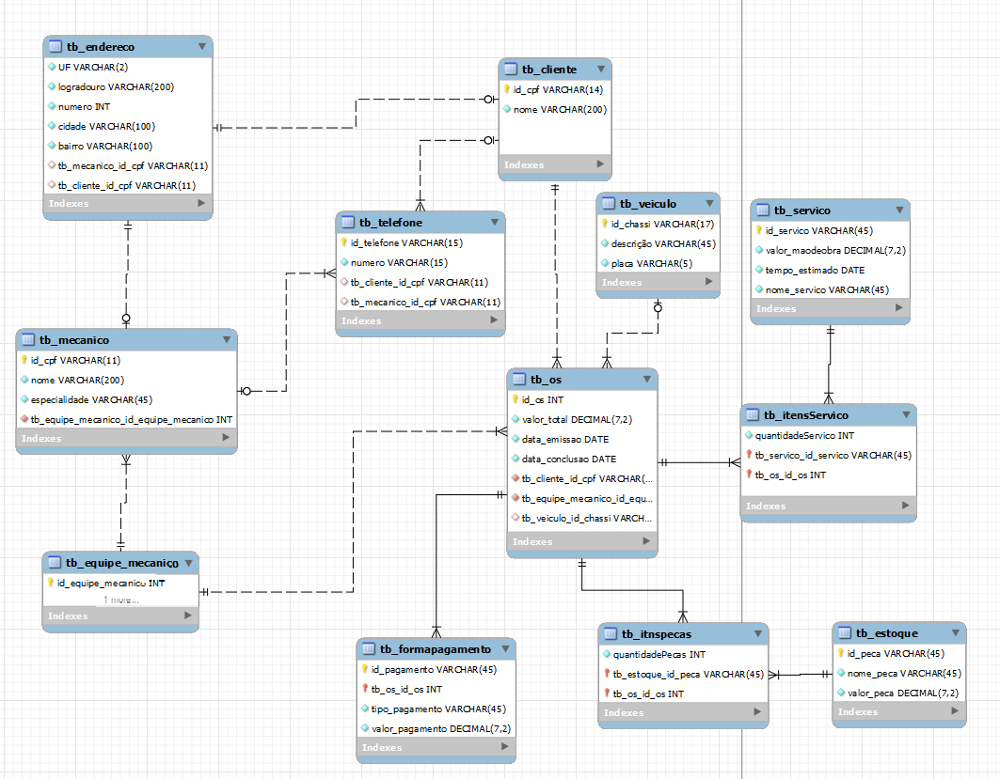
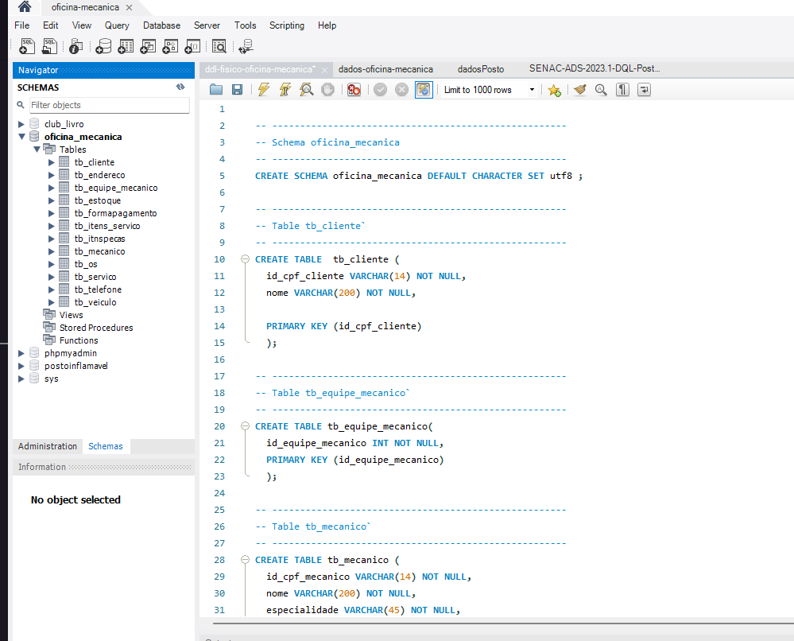

## 💻 Projeto

Um Banco de Dados com diagrama da modelagem de entidade relacionamento (MER) e modelagem relacional (MR)  do funcionamento dos registros das ordens de serviço(OS) de uma oficina mecânica. Neste caso, será usado o MySQL.  Foi desafiador entender as necessidades do cliente, estabelecer os relacionamentos e aplicar as Formas Normais(FN).

## Modelo de negócio do cliente  

Sistema de controle e gerenciamento de execução de ordens de serviço em uma
oficina mecânica: Clientes levam veículos à oficina mecânica para serem consertados
ou para passarem por revisões periódicas. 
● Cada veículo é designado a uma equipe de mecânicos que identifica os
serviços a serem executados e preenche uma ordem de serviço (OS) e prevê uma
data de entrega.. 
● A partir da OS, calcula-se o valor de cada serviço, consultando-se uma tabela
de referência de mão-de-obra. O valor de cada peça necessária à execução do serviço
também é computado.. 
● O cliente autoriza a execução dos serviços e a mesma equipe responsável pela
avaliação realiza os serviços. Clientes possuem código, nome, endereço e telefone.. 
● Veículos possuem código, placa e descrição.. 
● Cada mecânico possui código, nome, endereço e especialidade.. 
● Cada OS possui um número, uma data de emissão, um valor e uma data para
conclusão dos trabalhos. Uma OS pode ser composta de vários ítens (serviços) e um
mesmo serviço pode constar em várias ordens de serviço. Uma OS pode envolver
vários tipos de peças e um mesmo tipo de peça pode ser necessária em várias ordens
de serviço.

 

## Modelo Lógico  

 

## Modelo Físico  

 

## Tecnologia utilizada:

 
 

 

O projeto foi desenvolvido inicialmente com o br_Modelo e MySQL Workbench. Logo mais será inicido a codificão e implementação dos dados nas tabelas.

